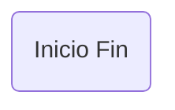
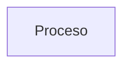
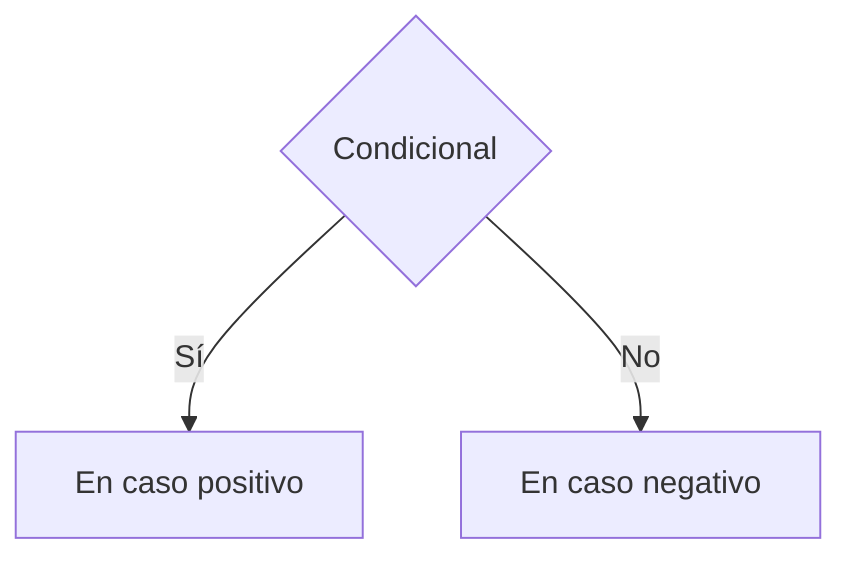
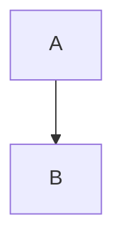
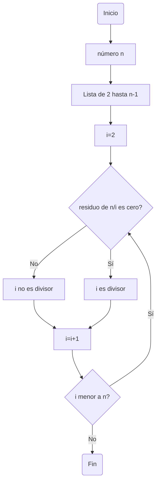

# Programación de Computadores - UNAL
## Lenguajes

## Comunicación
<table cellspacing="1" bgcolor="">
	<tr bgcolor="#252582">
		<th><b>Definición</b></th>
	</tr>
	<tr bgcolor="#e4e4ed">
		<td style="color:#141414">La comunicación es un proceso mediante el cual se transmite la información. Para que haya comunicación, debe haber una coincidencia en el tipo de lenguaje, es decir que, para codificar la información se requiere seguir unos lineamientos o reglas preestablecidas por un sistema con el cual está familiarizado tanto emisor como receptor. El emisor codifica, el receptor decodifica.</td>
	</tr>
</table>

<div align='center'>
<figure> </br>
<figcaption><b>Modelo matemático de la comunicación</b></figcaption></figure>
</div>

Elementos de la comunicación:
 + **Fuente de información:** Genera la información que será transmitida.
 + **Mensaje:** Dato o conjunto de datos a transmitir. Surge de la selección
de posibilidades en un conjunto de combinaciones simbólicas posibles.
 + **Emisor:** Codifica el mensaje.
 + **Señal:** Signos o símbolos del sistema convencional.
 + **Canal:** Medio por el cual se transmite el mensaje codificado.
 + **Fuente de ruido:** interferencia que distorsiona la señal y puede
cambiar el mensaje.
 + **Receptor:** Decodifica para poder ser recibido por el destino.
 + **Destino:** Ente al que se dirige el mensaje.

## Lenguaje
<table cellspacing="1" bgcolor="">
	<tr bgcolor="#252582">
		<th><b>Definición</b></th>
	</tr>
	<tr bgcolor="#e4e4ed">
		<td style="color:#141414">Un lenguaje está formado por tres elementos (el léxico, la sintaxis y la semántica), que permiten expresar y comunicar información entre entes, ya sean personas, animales, computadores, etc</td>
	</tr>
</table>

Componentes del lenguaje:
 + **Léxico:** El léxico de un lenguaje lo conforman las unidades mínimas con significado completo. A cada uno de estas unidades mínimas con significado se le conoce como lexema.
 + **Sintaxis:** La sintaxis de un lenguaje explica la forma en que se pueden construir frases en el lenguaje a partir del léxico. Usualmente la sintaxis se presenta como una colección de reglas de reescritura que se definen con una gramática. Estas son reglas que indican como unos símbolos de la ´ gramática pueden ser reescritos por otros símbolos de la gramática o por lexemas. La idea es que al final del proceso de reescritura sólo se tengan lexemas.
 + **Semántica:** La semántica de un lenguaje define la forma en que se le asocia significado (sentido) a las frases construidas mediante la gramática. En castellano la semántica no es fácil de definir ya que intervienen elementos muy elaborados que han sido construidos de manera natural a través del tiempo (cada objeto/idea conocido(a) por el ser humano esta asociado(a) con una palabra).

### Lenguaje de programación
<table cellspacing="1" bgcolor="">
	<tr bgcolor="#252582">
		<th><b>Definición</b></th>
	</tr>
	<tr bgcolor="#e4e4ed">
		<td style="color:#141414">Para ordenarle a una máquina de computo (computador) que ejecute cierto procedimiento o realice un cálculo predeterminado, se dispone de los lenguajes de programación, los cuales son definidos a partir del lenguaje matemático, por eso los computadores hacen exactamente lo que se les dice, no lo que se quiere que hagan. De esta manera, en programación se tiene un lenguaje bien definido donde los significados de las frases son ´unicos (no ambiguos). Esto exige que el programador exprese de forma precisa lo que desea hacer.</td>
	</tr>
</table>

### Paradigmas de programación de alto nivel
Los programas fuente escritos en lenguajes de alto nivel se compilan y a
partir de estos se generara un programa objeto de código de máquina. El
lenguaje de programación C entra en la clase de lenguajes compilados.
<div align='center'>
<figure> </br>
<figcaption><b>Programas compilados</b></figcaption></figure>
</div>

Otra forma de tratar los programas fuente es utilizando interpretes, en
estos se toma instrucción por instrucción, estas se traducen a un código
intermedio (Bytecode) similar al Ensamblador y de hay se traducen a
código de máquina, usualmente utilizando un programa que depende de la
plataforma y que se suele denominar La maquina virtual.
<div align='center'>
<figure> </br>
<figcaption><b>Programas interpretados</b></figcaption></figure>
</div>

## Algoritmos y lenguajes
Los lenguajes de muy alto nivel son fáciles de leer, comprender y programar, no requieren altos conocimientos de arquitecturas computacionales, esto los hace altamente transportables. El principal inconveniente de estos lenguajes es que no hacen uso eficiente de los recursos computacionales.

### Clasificación
Existen muchos lenguajes de programación de alto nivel con sus diferentes versiones. Por esta razón, es difícil su tipificación, pero una clasificación muy extendida desde el punto de vista de su estilo, forma de codificación y la filosofía de su creación es la siguiente:

 + **Lenguajes de programación imperativos:** Describe la programación en términos del estado de la memoria del programa y sentencias que cambian dicho estado. Los programas imperativos son un conjunto de instrucciones que se ejecutan secuencialmente y que le indican al computador cómo realizar una tarea. La implementación de hardware de la mayoría de computadores es imperativa ya que el hardware está dise~nado para ejecutar código de máquina el cual es imperativo. Ejemplos: Ensamblador, Cobol, Pascal, Fortran, BASIC, C, Perl, Ada, MathLab, SciLab, Python, Java Script.
 + **Lenguajes de programación estructurados o procedurales:** En un lenguaje estructurado un programa se descompone en procedimientos individuales (funciones) que realizan una tarea específica, para resolver un problema en conjunto. Ejemplos: Pascal, C++, Visual Basic, Python, Java, MathLab, SciLab.
 + **Lenguajes de programación orientados a objetos:** En la Programación Orientada a Objetos se organiza el código en unidades denominadas clases, de las cuales los objetos son instancias de éstas, que al relacionarse e interaccionar entre sí, permiten resolver los retos planteados. La Programación Orientada a Objetos trabaja de esta manera: todo el programa está construido con base a diferentes componentes (objetos), cada uno tiene un rol específico en el programa y todos los componentes pueden comunicarse entre ellos de forma predefinida. Para la construcción de las clases se utilizan técnicas tales como: abstracción, herencia, modularidad, polimorfismo, encapsulamiento y ocultamiento. Ejemplos: Smalltalk, C++, Java, Python, R.
 + **Lenguajes de programación declarativos:** Basado en la utilización de predicados lógicos (lógicos) o funciones matemáticas (funcionales), su objetivo es conseguir lenguajes expresivos en los que no sea necesario especificar cómo resolver el problema (programación convencional imperativa), sino qué problema se desea resolver. Los interpretes de los lenguajes declarativos tienen incorporado un motor de inferencia genérico que resuelve los problemas a partir de su especificación. Ejemplos: Lisp, ML, Haskell, Maude, Prolog, SQL.

## Programación estructurada
La programación estructurada es un estilo de programación de los años sesentas en el cual, la estructura de un algoritmo se hace tan clara como sea posible utilizando tres formas de organizar sus instrucciones:

Estos tres tipos de estructuras de control pueden combinarse para producir programas de computador tan complejos y largos como se quiera.

La lógica y propósito de un algoritmo estructurado puede comprenderse al leerlo de arriba hacia abajo. Esto facilita que el creador de un programa lo comparta con otros programadores, lo dé a conocer, o delegue en otros la labor de modificarlo.

Un programa (o algoritmo) estructurado tiene segmentos o componentes claramente definidos. Además, en cada componente está explícito un punto de inicio o entrada, y un punto de finalización o salida. Tal segmento de denomina un programa propio.

### Teorema de la estructura
Cualquier programa propio se puede escribir usando solamente las tres estructuras de control: secuencia, selección e iteración.

Un programa propio contempla dos propiedades básicas:
1. Tiene exactamente un punto de entrada y uno de salida
2. Entre el punto de entrada y el de salida hay trayectorias que conducen a cada parte del programa; esto significa que no existen grupos de instrucciones que se ejecuten indefinidamente, ni instrucciones que jamás se vayan a ejecutar.

#### Secuencia
 Las instrucciones del programa se ejecutan en el orden en el cual ellas aparecen en el texto del programa.
 <div align='center'>
<figure> </br>
<figcaption><b>Secuencia</b></figcaption></figure>
</div>

#### Selección
Permite escoger entre dos grupos de instrucciones, de acuerdo a la evaluación de una condición o predicado lógico. Se conoce como estructura **SI–ENTONCES–SINO**. En el siguiente diagrama, **P** representa un predicado y, **A** y **B** representan grupos de instrucciones. Debe ser claro que si **P** es falso, se realiza el conjunto de instrucciones **B**; de lo contrario se realiza **A**. Las flechas horizontales de más a la izquierda y de más a la derecha representan los puntos de entrada y salida, respectivamente.
<div align='center'>
<figure> </br>
<figcaption><b>Selección</b></figcaption></figure>
</div>

#### Iteración
Esta forma de control permite repetir varias veces una instrucción o conjunto de
instrucciones hasta cuando deje de cumplirse una condición (predicado lógico).
Se conoce como la estructura **HACER – MIENTRAS / REPETIR - PARA**. En el siguiente diagrama, **P** representa un predicado y A representa un grupo de instrucciones. Debe ser claro que siempre que **P** sea verdadero, se realiza el conjunto de instrucciones **A**; de lo contrario se termina la iteración. Las flechas horizontales de más a la izquierda y de más a la derecha representan los puntos de entrada y salida, respectivamente.
<div align='center'>
<figure> </br>
<figcaption><b>Iteración</b></figcaption></figure>
</div>

### Pseudocódigo
Un pseudocódigo es un lenguaje de programación informal que utiliza un conjunto de instrucciones sencillas para describir el flujo de un algoritmo. A diferencia de un lenguaje de programación formal, el pseudocódigo no tiene una sintaxis estricta y no se compila o se ejecuta directamente en una computadora. En cambio, se utiliza como una herramienta de comunicación entre el programador y otros miembros del equipo de desarrollo, o como una forma de planificar y diseñar un programa antes de escribir el código real.

El pseudocódigo se escribe en un lenguaje natural simple y utiliza una serie de convenciones de formato para denotar diferentes tipos de instrucciones, como asignaciones de variables, bucles y condicionales. El objetivo es que sea fácil de leer y entender por los programadores y otros colaboradores, y que sirva como una especie de borrador o esquema para el código real que se escribirá después.


Declaración de datos:
```pseudocode
n : entero
i : entero
```

Instrucciones:
```pseudocode
i := 2
```

Condicional:
```pseudocode
Si modulo(n,i) == 0 entonces
  escribir("i es divisor de n")
sino
  escribir("i no es divisor de n")
```

Iteraciones:
```pseudocode
Mientras (i < n) hacer
  instrucciones;
Fin mientras

Para (i=2 hasta n-1 con paso 1) hacer
  instrucciones
Fin para
```

En general un algoritmo en pseudocódigo se organiza de este modo:
```pseudocode
[datos variables]
inicio
  instrucciones
fin
```

El ejemplo de los divisores para un número n natural con el método no tan pro:

```pseudocode
[variables]
n : entero
i : entero
inicio
  i := 2
  Mientras (i < n) hacer
    Si modulo(n,i) == 0 entonces
      escribir("i es divisor de n")
    sino
      escribir("i no es divisor de n")
    i := i + 1
  Fin mientras
fin
```

<details><summary>Tips para pseudocódigo</summary><p>
<p align="justify">
La fácil, <a href="https://es.wikipedia.org/wiki/Pseudoc%C3%B3digo">aquí</a> se puede encontrar una buena explicación del pseudocode.
</p>

 Si quieren poner las cajas en pseudocódigo en markdown sería:

<pre><code>
```pseudocode
  instrucciones
```</code></pre>

O en HTML pueden revisar este <a href="https://stackoverflow.com/questions/2820453/how-to-display-raw-html-code-on-an-html-page">enlace</a>.

</p></details><br>

### Diagrama de flujo
Un diagrama de flujo es una herramienta gráfica utilizada para representar visualmente el flujo de un proceso o sistema. Consiste en una serie de símbolos estándar que representan diferentes tipos de acciones o procesos, conectados por flechas que muestran la dirección del flujo.

Permiten visualizar el proceso de una manera clara y concisa, lo que facilita la comprensión y la comunicación de los conceptos.

En general se tienen 4 componentes:

**Caja circular:** Representa el inicio o fin de la secuencia.


**Caja cuadrada:** Representa una operación o proceso.


**Condicional:** Representa una disyuntuva/pregunta.


**Flechas:** Indican el flujo del proceso.


Un ejemplo del algoritmo no tan pro para obtener la lista de los divisores de un número n natural dado.


<details><summary>Tips para los diagramas de flujo</summary><p>
<p align="justify">
Pueden utilizar <a href="https://app.diagrams.net">draw.io</a>, en general es bastante completo y se puede conectar con drive.
</p>

<div align='center'>
<figure> </br>
<figcaption><b></b></figcaption></figure>
</div>


<p align="justify">
Pero si quieren algo pro, <a href="https://docs.github.com/en/get-started/writing-on-github/working-with-advanced-formatting/creating-diagrams">aquí</a> encuentran la manera de hacer diagramas con code usando <a href="https://mermaid.js.org/syntax/flowchart.html">mermaid</a> (como los verdaderos pros, no como noobs arrastrando bolitas y palitos).
<a href="https://mermaid.live/">Editor </a>en línea de mermaid.
</p>

<div align='center'>
<figure> </br>
<figcaption><b></b></figcaption></figure>
</div>
</p></details><br>


---------------
## Manejo inicial de repos en github


---------------
## Notebooks de Jupyter


---------------
## Reto no. 4
1. Plantear el algoritmo para obtener los números primos hasta n, usando pseudocódigo y diagramas de flujo.

2. Revise el procedimiento matemático para hallar raices cuadradas (son divisiones y restas), plantee el algoritmo en pseudocódigo y en diagrama de flujo.

3. Cree un repositorio en github en donde muestre el desarrollo de la actividad y comparta el enlace por el canal de slack *reto_4*.


